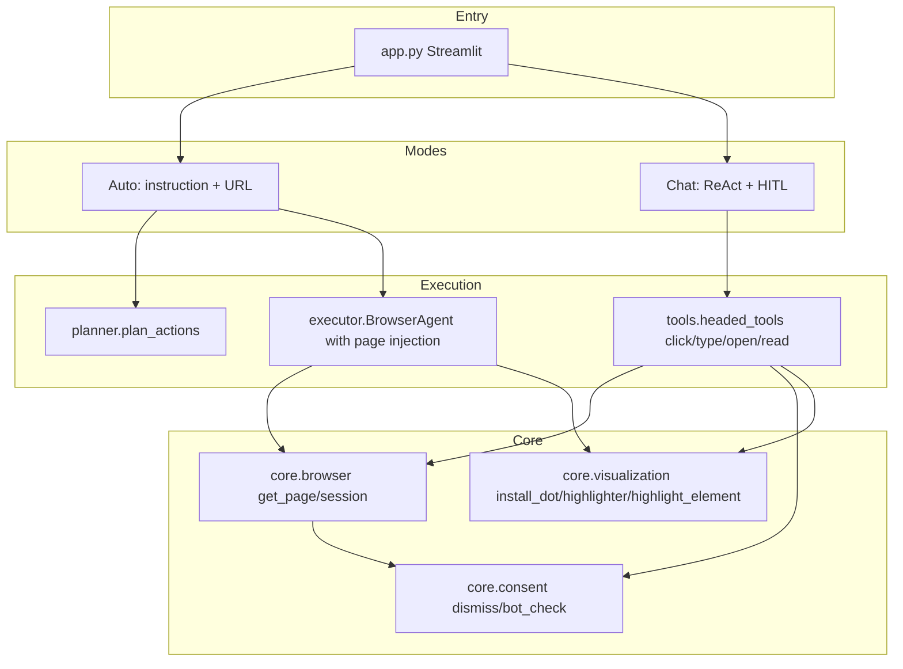

# Agent-Browser Integration and Visualization Structure

## Current State

- **[main.py](c:\Users\admin\Downloads\Agent-Broswer\main.py)** + **[planner.py](c:\Users\admin\Downloads\Agent-Broswer\planner.py)** + **[executor.py](c:\Users\admin\Downloads\Agent-Broswer\executor.py)**: Standalone auto pipeline with its own `BrowserAgent`, no `session_id`.
- **[HITL.py](c:\Users\admin\Downloads\Agent-Broswer\HITL.py)**: Terminal-only LangGraph HITL with headless browser tools.
- **[README.md](c:\Users\admin\Downloads\Agent-Broswer\README.md)**: Embeds full Streamlit app (`BROWSER_SESSIONS`, `get_page`, `open_url_headed`, `click_on_page`, `highlight_locator`, ReAct agent, etc.) as non-executable content, hard to maintain.

Integration goal: **single entry, two modes, shared browser session, optional visualization**.

---

## Proposed Directory and File Structure

```
Agent-Broswer/
├── app.py                    # Single entry: Streamlit, mode switch (Auto / Chat)
├── config.py                 # Env vars and constants (ANTHROPIC_API_KEY, model names, etc.)
│
├── core/
│   ├── __init__.py
│   ├── browser.py            # Shared browser session: get_page(session_id), start/stop_session, safe_page_snapshot
│   ├── consent.py            # dismiss_cookie_consent, looks_like_bot_challenge (extracted from README)
│   └── visualization.py      # Visualization: DOT_JS, HILITE_JS, install_dot, install_highlighter, highlight_element_for_agent
│
├── planner.py                # Keep; plan_actions(instruction, context), depends only on config
│
├── executor.py               # Refactor: support injected page (or session_id + get_page), call visualization before/after execution
│
├── agent/
│   ├── __init__.py
│   ├── auto.py               # run_auto_agent(instruction, start_url, session_id, enable_viz): planner + executor, shared core.browser
│   └── chat.py               # ReAct tools + graph; tools use get_page(session_id), optional highlight before click/type
│
├── tools/                    # ReAct tools: open_url_headed, read_page_headed, find_text_on_page, click_on_page, type_text_on_page, close_browser_headed, etc.
│   ├── __init__.py
│   └── headed_tools.py       # @tool functions extracted from README + ensure_thread_event_loop; depends on core.browser, core.consent, core.visualization
│
├── HITL_terminal.py          # Optional: keep original HITL.py terminal logic, or merge as "terminal mode" in app
│
├── README.md                 # Documentation only: project description, how to run (streamlit run app.py), env vars, structure overview
│
└── (optional) scripts/       # Standalone scripts
    └── border_dates_demo.py  # Google-Search-BorderDates logic, if needed separately
```

Notes:

- **Single entry**: `streamlit run app.py`. Sidebar or top bar to choose "Auto" or "Chat", and optional "Enable behavior visualization".
- **Shared session**: `get_page(session_id)` in `core/browser.py` matches current README logic; executor and agent/chat both use the same browser via the same `session_id`.
- **Visualization**: Centralized in `core/visualization.py`, sourced from [Borderering-cursor.txt](c:\Users\admin\Downloads\Agent-Broswer\Borderering-cursor.txt) (`DOT_JS`, `HILITE_JS`, `install_dot`, `install_highlighter`, and `window.__pw_highlight_element(el)` from `hover_and_click_locator`).

---

## Data Flow and Call Relationships



- **Auto mode**: App calls `agent/auto.run_auto_agent(...)`, which uses `get_page(session_id)` to get the page and passes it to the refactored Executor; if visualization is enabled, Executor calls `core.visualization.highlight_element_for_agent(page, locator)` (or runs `install_dot`/`install_highlighter` first) before each action.
- **Chat mode**: App uses the graph and ReAct from `agent/chat`; tools live in `tools/headed_tools.py`, also using `get_page(session_id)` and optional visualization.

---

## How Visualization Is Wired In

1. **Source**: From [Borderering-cursor.txt](c:\Users\admin\Downloads\Agent-Broswer\Borderering-cursor.txt) extract:
   - `DOT_JS`, `HILITE_JS` strings.
   - `install_dot(page)`, `install_highlighter(page, **opts)` in `core/visualization.py`.
   - For programmatic highlight of the element about to be acted on: after `install_highlighter` on the page, use `page.evaluate("(el) => window.__pw_highlight_element && window.__pw_highlight_element(el)", element_handle)` (same as in `hover_and_click_locator`).
2. **Integration points**:
   - **Auto mode**: In [executor.py](c:\Users\admin\Downloads\Agent-Broswer\executor.py) `execute(action)`, before `robust_click` or `type`, when `enable_viz=True`: (1) on first page load, call `install_dot(page)` and `install_highlighter(page, show_label=True)`; (2) resolve target locator from `action`, get `element_handle`, call `__pw_highlight_element` above, then perform click/type.
   - **Chat mode**: In `tools/headed_tools.py` `click_on_page` (and optionally `type_text_on_page`), in addition to existing `highlight_locator(loc)`, when the global visualization flag is on, ensure `install_dot`/`install_highlighter` are injected on the current page, then call `__pw_highlight_element` on the element about to be clicked so the user sees the border/label.
3. **Streamlit switch**: Add a "Behavior visualization" checkbox in the `app.py` sidebar; pass its state into `run_auto_agent(..., enable_viz=...)` and into the ReAct tool path (e.g. via `st.session_state.enable_viz` or a thread-local for tools).

---

## Key Implementation Points (planning only)

| Item | Description |
|------|-------------|
| **config.py** | Centralize `os.getenv("ANTHROPIC_API_KEY")` / `API-KEY`, model list; planner and chat agent read from here. |
| **core/browser.py** | Move from README: `BROWSER_SESSIONS`, `_get_session`, `start_browser_session`, `stop_browser_session`, `get_page`, `safe_page_snapshot`; keep Windows `ensure_thread_event_loop` here or in a small module. |
| **core/consent.py** | Move from README: `CONSENT_SELECTORS`, `dismiss_cookie_consent`, `looks_like_bot_challenge`. |
| **core/visualization.py** | Move from Borderering-cursor.txt: `DOT_JS`, `HILITE_JS`, `install_dot`, `install_highlighter`; provide `highlight_element_for_agent(page, locator_or_handle)` wrapping `__pw_highlight_element`; optional `ensure_overlays_installed(page)` to inject dot + highlighter on first use. |
| **executor.py** | Add construction: `BrowserAgent(page=page)` or `BrowserAgent(session_id=..., get_page=...)`, no longer create playwright instance internally; in `execute`, call `core.visualization` when `enable_viz` is set. |
| **agent/auto.py** | Implement `run_auto_agent(instruction, start_url, session_id, enable_viz)`: `get_page(session_id)` → navigate if needed → `get_context()` → `plan_actions` → loop with `Executor(page=page, enable_viz=enable_viz).execute(action)` and snapshot; do not close browser in auto (session manages it). |
| **tools/headed_tools.py** | Move all headed `@tool` implementations from README; depend on `core.browser`, `core.consent`; in `click_on_page` call `core.visualization` when global visualization flag is on. |
| **agent/chat.py** | Move ReAct build from README (`create_react_agent`, system prompt, model fallback); use `tools.headed_tools` tool list; no Streamlit UI code, only return an invokable agent. |
| **app.py** | Streamlit: mode selection (Auto / Chat), visualization switch, session_id handling; Auto mode calls `agent.auto.run_auto_agent` and shows screenshots/logs; Chat mode invokes/streams `agent.chat` and renders messages and tool results. |
| **HITL_terminal.py** | Keep original [HITL.py](c:\Users\admin\Downloads\Agent-Broswer\HITL.py) terminal logic, or wire from `agent.chat` graph with `interrupt`/`Command(resume=...)` in a terminal loop so `python HITL_terminal.py` remains a pure terminal HITL. |

---

## Environment and Dependencies

- Keep existing dependencies; `config.py` reads `ANTHROPIC_API_KEY` (or `API-KEY`) and `CLAUDE_MODEL` in one place.
- README stays documentation only: how to install, how to run `streamlit run app.py`, env vars, and the structure overview above; no large embedded executable code.

---

## Optional Follow-ups

- Keep a single copy of the dot logic from [Dot-cursor code.txt](c:\Users\admin\Downloads\Agent-Broswer\Dot-cursor code.txt) in `core/visualization.py` (deduplicate with Borderering).
- If [Google-Search-BorderDates.txt](c:\Users\admin\Downloads\Agent-Broswer\Google-Search-BorderDates.txt) is needed standalone, extract to `scripts/border_dates_demo.py`, not part of the main app.
- After refactor, archive or remove the three txt files to avoid duplication with production code.

This structure achieves integration of main/planner/executor with HITL/Streamlit Chat and a shared session, plus visualization of agent behavior (red dot + element highlight), with a clear entry point and responsibilities.
